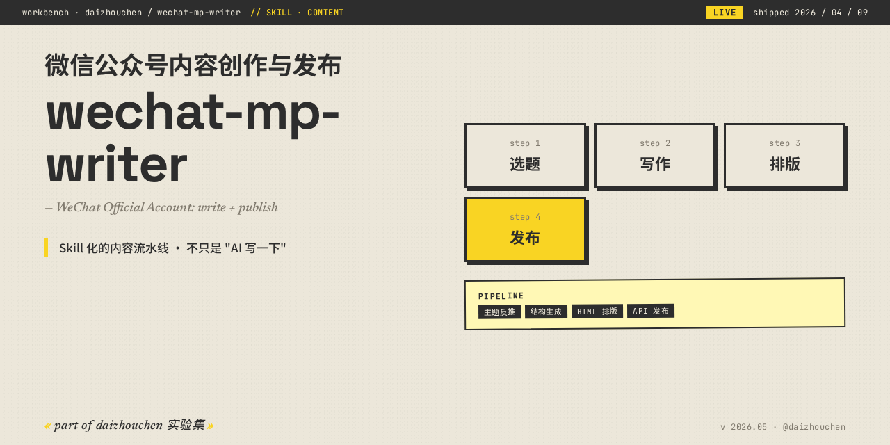

<!-- daizhouchen-banner-begin -->
<p align="center">
  
</p>

> **微信公众号内容创作与发布 · Skill 化的内容流水线。**
>
> *WeChat Official Account content pipeline as a skill.*
<!-- daizhouchen-banner-end -->

# wechat-mp-writer

微信公众号内容创作与发布 Claude Code Skill。覆盖信息搜集、内容撰写、排版和 API 发布的完整工作流。

**当前版本 v2.1.3**：从来源搜集、结构化写作、配图审查到微信兼容排版。来源分级和信任度报告保存在 `article.json`，默认不显示在成稿中；交互会话优先使用宿主的看图能力，独立 Vision API 为可选路径。

## 核心能力

- **三层证据链**：事实层 → 机制层 → 观点层。每条观点必 cite ≥3 条事实，每段必含具体名词（人名/公司/数字/年份），禁止"裸观点"和"框架名出现在正文"。详见 `references/content-engine.md`。
- **来源 A/B/C/D 分级**：每条信息记录来源等级，在 `article.json` 中计算信任度报告，供核查使用。详见 `references/source-grading.md`。
- **6 段图片 Pipeline + Vision 审查**：实体级搜词 → 多源抓取（Wikimedia / Unsplash / 官方 / 本地 / Web）→ 去重 → **Claude Vision 三项审查（对题度 / 清晰度 / 手机适配，各 0-5 分）** → 段落语义匹配 → 失败回退（SVG / 引述块 / 跳过）。详见 `references/image-pipeline.md`。
- **7 种排版骨架 + 防审美疲劳**：数据先行 / 故事开篇 / 问答列表 / 时间线 / 对比表 / 拆解清单 / 访谈摘录。按主题选择骨架、强调色与装饰；当前字数档位为短 2500–3500 / 中 3500–5500 / 长 5500–8000（中文 + 英文 token × 0.5）。详见 `references/layout-variants.md`。
- **article.json 结构化中间产物**：可改、可量化、可复用。改某段事实只动 JSON 一个字段。详见 `references/article-schema.md`。
- **25 项量化质量闸门**：`scripts/quality_check.py` 检查来源、素材利用率、字数、图片审查、排版等，结果写回 `article.json`。未通过检查时先修订文章。

以上资源路径相对于 [Skill 目录](skills/wechat-mp-writer/)，完整入口为 [SKILL.md](skills/wechat-mp-writer/SKILL.md)。

## v1 功能（保留 + 兼容）

- **用户画像持久化**：首次配置公众号定位、读者画像、写作风格，保存为 `.wechat-profile.md`，后续自动加载
- **主动信息搜集**：接到主题后自动用 WebSearch/WebFetch 搜集行业数据、专家观点、竞品分析，先出素材卡再动笔
- **去 AI 味五铁律**：禁止 emoji 装饰、禁止 AI 套话、像人类专家一样写作（v2 在五铁律之上加红线 6-10）
- **多风格标题生成**：8 种风格，生成 5+ 候选（v2 升级为 Title × Hook × CTA 三件套 + 9 分制评分）
- **8 种内容模板**：干货教程、观点评论、行业分析、产品介绍、活动推广、人物故事、盘点清单、对比测评
- **微信兼容 HTML 排版**：4 套预设配色、完整的文字层级体系、移动端适配
- **API 发布工作流**：创作 → 上传素材 → 存草稿 → 预览 → 确认 → 发布
- **一条龙模式**：说"一条龙"或"全自动"，从搜集资料到发布全程无需确认（v2 默认开启 vision 审查 + 信任度报告）
- **SEO 优化**：搜一搜关键词策略、社交传播优化、发布时间推荐、转发引导话术

## 安装

### 方式一：通过 Claude Code CLI 安装（推荐）

```bash
# 1. 注册 marketplace
claude plugin marketplace add https://github.com/daizhouchen/wechat-mp-writer.git

# 2. 安装插件（全局）
claude plugin install wechat-mp-writer@wechat-mp-writer --scope user

# 3. 重新加载（在 Claude Code 中执行）
/reload-plugins
```

安装完成后，在任何对话中说"写一篇公众号文章"或输入 `/wechat-mp-writer:wechat-mp-writer` 即可触发。

### 方式二：从本地目录加载

```bash
# 克隆仓库
git clone https://github.com/daizhouchen/wechat-mp-writer.git

# 启动一个加载本地插件的 Claude Code 会话
claude --plugin-dir ./wechat-mp-writer
```

这种方式适合本地试用和修改；持久安装使用方式一。参见 [Claude Code 插件文档](https://code.claude.com/docs/en/plugins)。

### 运行依赖

- Python 3.10+。`wechat_api.py`、`quality_check.py`、基础搜图使用标准库。
- 独立 Vision API 审图：`python -m pip install anthropic`，并配置 `ANTHROPIC_API_KEY`；会产生 API 用量。
- PIL 图片模板：`python -m pip install Pillow`，并准备中文字体；通过 `WECHAT_FONT_PATH` 指定字体文件。默认输出到当前目录的 `articles/demo-slug/images/`，可用 `WECHAT_IMAGE_OUTPUT_DIR` 覆盖。
- `publish.sh` 需要 Bash（Windows 可使用 WSL 或 Git Bash）。仅写作、排版不需要微信 API 凭据。

下文的脚本命令均从仓库根目录运行；安装为插件时，使用插件目录内对应脚本的绝对路径。

### 卸载

```bash
claude plugin uninstall wechat-mp-writer@wechat-mp-writer
claude plugin marketplace remove wechat-mp-writer
```

## 配置

### 1. 公众号画像配置（首次使用时自动引导）

Skill 会引导你配置公众号定位、目标读者、写作风格等，保存为项目目录下的 `.wechat-profile.md`，后续自动加载。

### 2. 微信公众平台 API 凭据

发布功能需要配置 API 凭据：

```bash
# 在项目目录创建 .env 文件
cat > .env << 'EOF'
WECHAT_APP_ID=your_app_id
WECHAT_APP_SECRET=your_app_secret
WECHAT_PREVIEW_USER=your_wechat_id
EOF
```

获取方式：登录 [mp.weixin.qq.com](https://mp.weixin.qq.com) -> 设置与开发 -> 基本配置

验证：
```bash
python3 skills/wechat-mp-writer/scripts/wechat_api.py check
```

> 注意：预览和发布 API 需要**已认证的订阅号或服务号**。未认证账号可以正常创建草稿，然后在公众号后台手动发表。

## 使用方式

### 标准模式（带确认）

```
帮我写一篇关于 AI Agent 的公众号文章
```

Skill 会按步骤执行：搜集信息 -> 展示素材卡 -> 等你选角度 -> 生成标题候选 -> 撰写全文 -> 获取图片 -> 等你确认 -> 发布

### 一条龙模式（全自动）

```
一条龙帮我写一篇 AI 行业洞察的公众号文章并发布
```

从搜集资料到发布全程自动，无需任何确认。完成后输出简报。v2 一条龙默认开启 vision 审查 + 信任度报告 + quality_check。

### v2 单独使用某个工具

```bash
# 实体级搜图（搜 Sam Altman 的图，从 Wikimedia）
python3 skills/wechat-mp-writer/scripts/image_search.py search \
    --keywords "Sam Altman portrait" --source wikimedia --limit 5 \
    --download ./articles/my-article/images/

# Vision 审查整篇 article.json 里所有候选图
export ANTHROPIC_API_KEY=sk-ant-...
python3 skills/wechat-mp-writer/scripts/image_vision_review.py batch \
    --plan ./articles/my-article/article.json

# 跑质量闸门（会更新 article.json 的检查报告；保留原稿时请先复制文件）
python3 skills/wechat-mp-writer/scripts/quality_check.py check \
    --article ./articles/my-article/article.json \
    --html ./articles/my-article/article.html
```

## 目录结构

```
wechat-mp-writer/
├── .claude-plugin/
│   ├── plugin.json                 # 插件描述
│   └── marketplace.json            # Marketplace 注册信息
├── skills/
│   └── wechat-mp-writer/
│       ├── SKILL.md                # Skill 主文件（完整工作流指令 + v2 升级）
│       ├── scripts/
│       │   ├── wechat_api.py         # 微信API工具（token/素材/草稿/发布）
│       │   ├── compliance_check.py   # v1 合规检查（保留向后兼容）
│       │   ├── image_search.py       # [v2] 实体级搜词 + 多源抓取 + 去重
│       │   ├── image_vision_review.py# [v2] Claude Vision 三项审查（对题度/清晰度/手机适配）
│       │   ├── quality_check.py      # 量化质量闸门（当前 25 项）
│       │   ├── render_pil_template.py# Pillow 封面 / 矩阵图模板
│       │   └── publish.sh            # Bash 草稿 / 发布工作流
│       ├── references/
│       │   ├── content_templates.md    # 8 种内容类型模板（v1）
│       │   ├── wechat_html_compat.md   # 微信 HTML 兼容性 + 排版组件（v1）
│       │   ├── error_codes.md          # API 错误码对照表（v1）
│       │   ├── content-engine.md       # [v2] 三层证据链 + 选题 5 步法 + AI slop 红线 6-10
│       │   ├── source-grading.md       # [v2] A/B/C/D 分级 + 信任度报告
│       │   ├── image-pipeline.md       # [v2] 图片 6 段 pipeline + Vision 审查规约
│       │   ├── layout-variants.md      # [v2] 7 种排版骨架 + 防重复 + 字数 budget
│       │   └── article-schema.md       # [v2] article.json 中间产物结构
│       └── assets/
│           └── examples/
│               └── sample-article.json # [v2] DeepSeek R1 示例文章的完整 JSON
├── README.md
└── .gitignore
```

## License

MIT

---
<!-- daizhouchen-footer-begin -->

Part of [**daizhouchen 实验集**](https://github.com/daizhouchen) → 一个 AI 应用创造者的实验现场。
<!-- daizhouchen-footer-end -->
